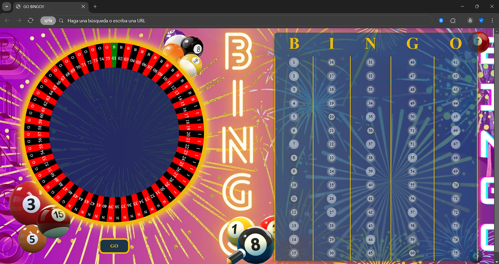
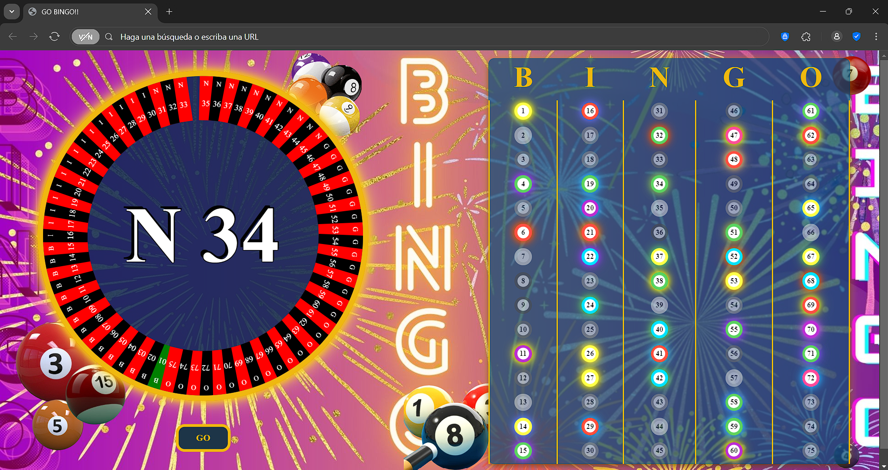

# 🎡 GO-BINGO: Ruleta Interactiva + Cartilla Digital

## 🌟 ¡Bienvenido al Bingo 2.0! 
Un juego **todo-en-uno** que reemplaza:
- 🎰 Ruletas físicas
- 📋 Hojas de Excel para tracking
- 🔢 Lápices para marcar números

<div align="center">
  
</div>

## 🎮 Cómo Funciona

### 🔄 Ruleta Dinámica
- Gira con movimiento aleatorio (izquierda/derecha, rápido/lento)
- 3 efectos de sonido aleatorios al girar
- Pausa dramática antes de revelar el número

### 🖍️ Cartilla Inteligente
- Todos los números en pantalla
- Toca el número salido ¡y se ilumina!
- Efecto de brillo con colores aleatorios

## ✨ Características
- Sección	🔥 Novedad
- Ruleta	Movimiento fluido con física realista
- Cartilla	Efectos visuales al marcar números
- Sonidos	Ambiente inmersivo con audio 3D

## 📸 Capturas
  
Lo que veras al levantarlo

-  
Asi se vera a medio juego

-  
Asi se vera al termianr el juego

- 

## 🚀 Instalación
```diff
git clone https://github.com/Sofia-Itusaca/GO-BINGO-JS-CSS-HTML.git
cd GO-BINGO-JS-CSS-HTML
